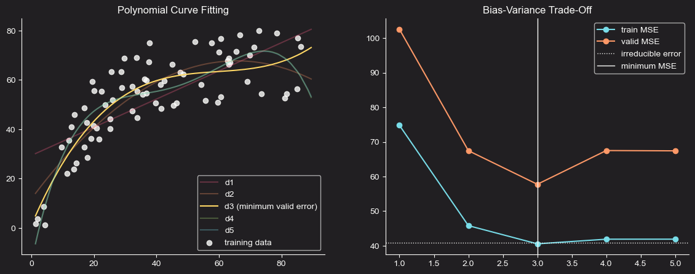
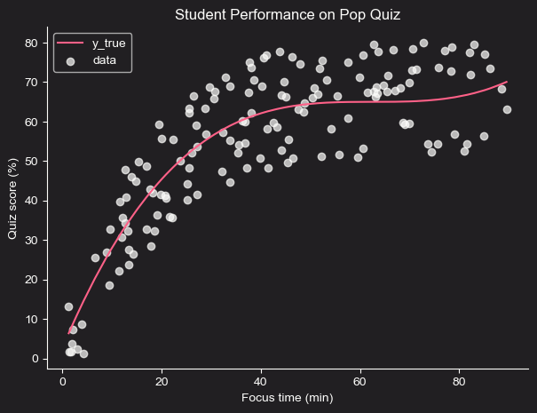
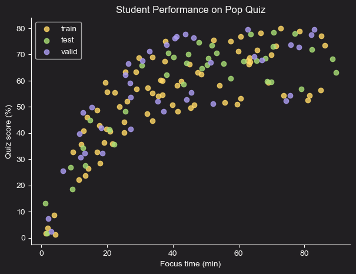
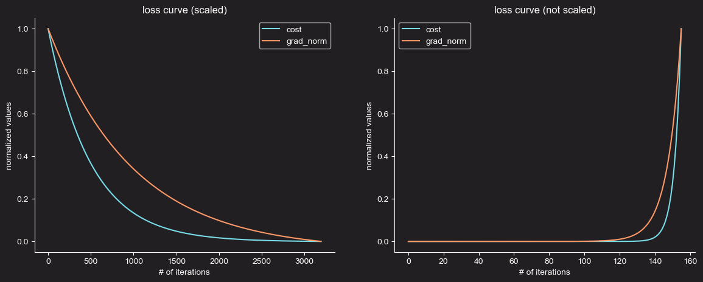
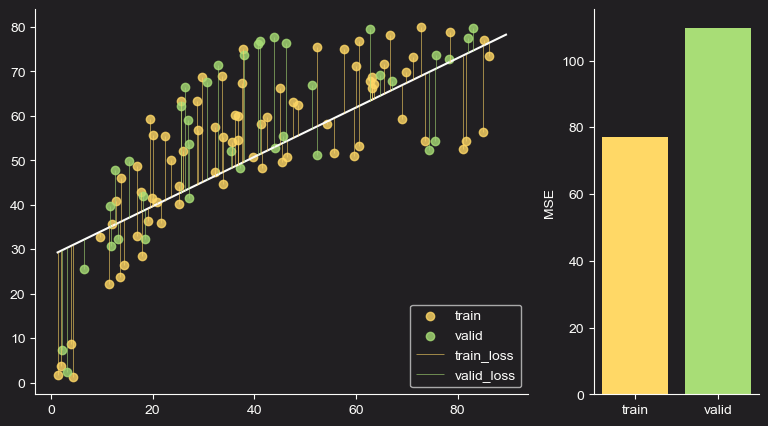
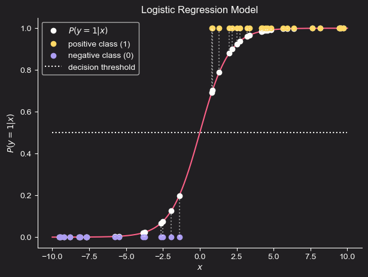
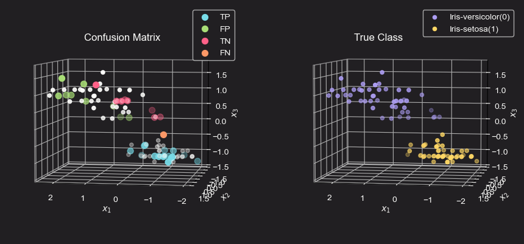

# Machine Learning from Scratch
Machine Learning models & concepts from scratch through personal notes & implementation using Python & `NumPy` for vectorization.

  

    
    
  

  

    
  

## Content Overview
The project is organized to be clean and easy to navigate:

* `notebooks/`: Contains the Jupyter Notebooks that walk through the implementation, explanation, and visualization of each algorithm.
* `custom_models/`: The core Python scripts containing the class-based implementations of the machine learning models.
* `data_utils/`: Utility scripts for data loading and preprocessing.
* `images/`: Visualizations and plots generated from the notebooks.

## Visualization Highlights
Linear Regression:

  

    
    
  

  

    
  

  

    
  

  

    
  

Classification:

  

    
  

  

    
  

