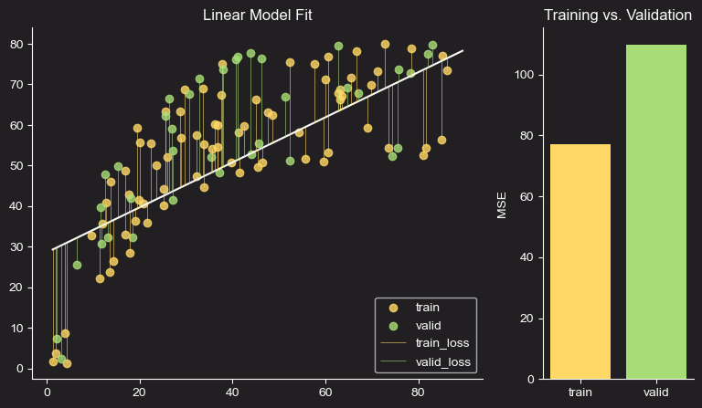

# Machine Learning from Scratch
**Purpose:** to implement ML models and concepts from scratch using NumPy for personal learning purposes.

     

## Navigation
* `notebooks/`: Contains the Jupyter Notebooks that walk through the implementation, explanation, and visualization of each algorithm.
* `custom_models/`: The core Python scripts containing the class-based implementations of the machine learning models.
* `data_utils/`: Utility scripts for data loading and preprocessing.
* `images/`: Visualizations and plots generated from the notebooks.

## Current Content Overview

## Visualization
Linear Regression:
<table align="center">
  <tr>
    <td>
      
    </td>
    <td>
      
    </td>
  </tr>
</table>
<table align="center">
  <tr>
    <td>
      
    </td>
  </tr>
</table>
<table>
  <tr>
    <td>
      
    </td>
  </tr>
</table>
    
<table align="center">
  <tr>
    <td>
      
    </td>
  </tr>
</table>
Classification:
<table align="center"
  <tr>
    <td>
      
    </td>
  </tr>
</table>

<table align="center">
  <tr>
    <td>
      
    </td>
  </tr>
</table>

