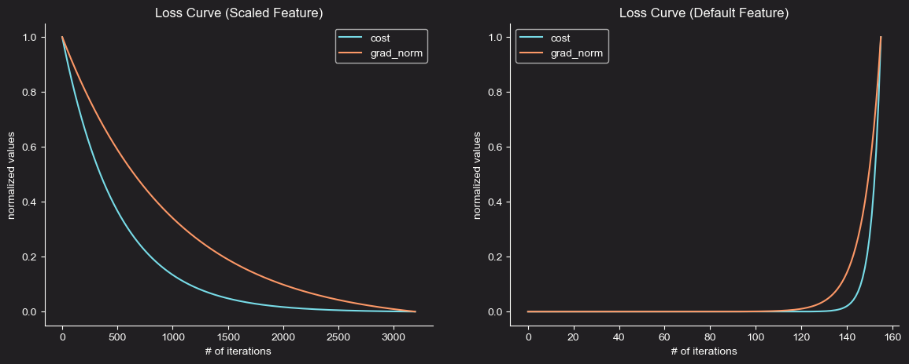

# Machine Learning from Scratch
Machine Learning models & concepts from scratch through mathematical notes & implementation using Python & `NumPy` for vectorization.

<table align="center" style="border-collapse: collapse; border: none;">
  <tr style="border: none;">
    <td style="border: none;" ></td>
    <td style="border: none;"></td>
  </tr>
</table>

## Content Overview
The project is organized to be clean and easy to navigate:

* `notebooks/`: Contains the Jupyter Notebooks that walk through the implementation, explanation, and visualization of each algorithm.
* `custom_models/`: The core Python scripts containing the class-based implementations of the machine learning models.
* `data_utils/`: Utility scripts for data loading and preprocessing.
* `images/`: Visualizations and plots generated from the notebooks.

## Current Highlights
Linear Regression Processes:
<table align="center" border=0>
  <tr>
    <td>
      
    </td>
    <td>
      
    </td>
  </tr>
</table>
<table align="center" border=0>
  <tr>
    <td>
      
    </td>
  </tr>
</table>
<table>
  <tr>
    <td>
      
    </td>
  </tr>
</table>
    
<table align="center" border=0>
  <tr>
    <td>
      
    </td>
  </tr>
</table>
Classification:
<table align="center" border=0>
  <tr>
    <td>
      
    </td>
  </tr>
</table>

<table align="center" border=0>
  <tr>
    <td>
      
    </td>
  </tr>
</table>

